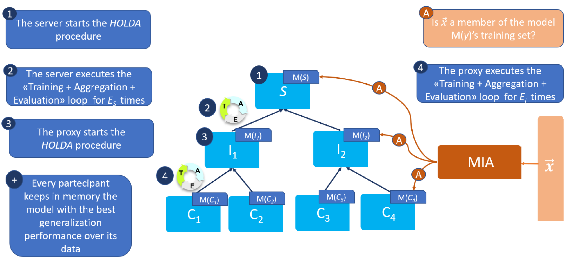

# Overview
This is the official code for the paper [A new approach for cross-silo federated learning and its privacy risks](https://ieeexplore.ieee.org/document/9647753)

# HOLDA

# Usage
The main entry point of the system is the `holda.py` file.

`python holda.py --file architectures/holda_not_hier.xml --pers`

The command shown above executes the following steps:
  - It reads the .xml file passed in input (--file), which describes the architecture of the federation that has to be adopted during the training procedure. More details about the structure of the .xml file is provided in a following section.
  -  It executes `HOLDA` according to the information provided in the .xml file.
  -  At the end of the main training procedure, it personalises the (intermediate / local) models, throughout a fine-tuning procedure (if the --pers flag is activated).
  -  The final models are located into the file, whose path is specified in the xml file. (tag: `ckpt_best`)

This repository contains two simple working examples, located into the `scripts` folder.
  - `execute_example.sh` : it executes a non-hierarchical training on the adult dataset (located into `examples/dataset` folder). The federation comprises one server and 4 clients, directly connected to the main server. Before starting the training, it creates the xml file, starting from the baseline architecture, stored into the  `architecture/baselines/example_not_hier_holda_base.xml` file. The final architecture is stored into `architecture/holda/holda_not_hier.xml`

  - `execute_hier_example.sh` : it executes a hierarchical training on the adult dataset (located into `examples/dataset` folder). The federation comprises one server, 2 proxies and 4 clients, like the one depicted in the picture. Before starting the training, it creates the xml file, starting from the baseline architecture, stored into the  `architecture/baselines/example_hier_holda_base.xml` file. The final architecture is stored into `architecture/holda/holda_hier.xml`

  
## Structure of the xml file
This file contains the description of:
  - the architecture of the federation that has to be adopted in order to execute the training procedure
  - the metadata of each single node of the federation
  - the training parameters for each node (server, proxy, client)

At the high level, the file has to include the following tags:
- `root_node`: it is the root of the tree
- `task`: It describes the task that has to be solved.
- `model`: It describes how to build the model that has to be trained during the execution of `HOLDA`.
- `metrics` : It describes what are the metrics that have to be computed during the training.
- `setting` : It specifies some setting parameters.
- `architecture` : It describes the structure of the federation.
### The `task` node
It describes the task that has to be solved. 
The node has to contain the following tags:
- `n_features` : the number of features of the dataset
- `n_classes` : the number of target classes of the dataset
- `target` : the name of the target column of the dataset

An example is the following one:
```
<task>
        <n_features> 103 </n_features>
        <n_classes>2</n_classes>
        <target>income</target>
</task>
```
Here, we are saying that our dataset has 103 attributes, 2 possible classes and the target column is named `income`.

### The `model` node
It describes how to build the model that has to be trained during the execution of `HOLDA`.
The node has to contain the following tags:
-`model_fn` : the function that has to be used to instantiate the model (it needs the whole path).
-`params` : this tag has one child for each parameters needed by the `model_fn` function. The tag of the child has to be the name of the correspondig parameter.

An example is the following one.
Assume that we construct the model using this function

```
def create_simple_net(hidden_1, dropout, output, input):
    net = SimpleNet(hidden_1, dropout, output, input)
    return net
```

where `SimpleNet` is defined as:

```
class SimpleNet(nn.Module):
    def __init__(self, hidden_1, dropout, output, input):
        super(SimpleNet, self).__init__()

        self.fc1 = nn.Linear(input, hidden_1)
        self.fc2 = nn.Linear(hidden_1, output)
        self.drop = nn.Dropout(dropout)

    def forward(self, x):
        x = F.relu(self.fc1(x))
        x = self.drop(x)
        x = self.fc2(x)
        return x
```

Then, the following tag,
```
<model>
  <model_fn>models.nn.create_simple_net</model_fn>
   <params>
      <input>103</input>
      <hidden_1>200</hidden_1>
      <dropout>0.2</dropout>
      <output>2</output>
   </params>
</model>
```
is just like calling `models.nn.simple_net(input=103,hidden_1=200,dropout=0.2,output=2)`

This structure is kept the same whenever we need to perform any function invocation during the trainign algorithm.
In particular this is the schema adopted for describing the loss function and the local optimizer.

### The `setting` node
It is used to set up some options during the training.
As of now, it contains just one available option:
- `use_deltas` : If it is True, the node encrypts the model parameters using the delta encoding.
  
### The `metrics` node
It describes what are the metrics that have to be computed during the training, other than the loss function.
The system currently supports the following metrics: 
- `accuracy`
- `precision`
- `recall`
- `f1`

I highly recommend to keep at least the `f1` metric, since it is the one used to choose the best generalizing model.

```
<metrics>
  <metric>accuracy</metric>
  <metric>precision</metric>
  <metric>recall</metric>
  <metric>f1</metric>
</metrics>
```

### The `architecture` node
It describes the structure of the federation.
The main idea under this structure is: if we have 
```
<node1>
  <node2> </node2>
  <node3> </node3>
</node1>
```
This means that `node2` and `node3` are directly connected to `node1`.

The available tags in this section are:
- `<server>` 
- `<proxy>`
- `<client>`

The `<server>` has to be the root of the hierarchy. It can have any number of  `<proxy>` or  `<client>` children.
The `<proxy>` can have any number of  `<proxy>` or  `<client>` children.
The `<client>` has to be a leaf.

As an example, in order to describe the federation depicted in the picture at the beginning we need to provide the following structure:
```
<architecture>
  <server>
    <proxy>
      <client></client>
      <client></client>
    </proxy>
     
    <proxy>
      <client></client>
      <client></client>
    </proxy>
  </server>
<\architecture>
```

Inside each node we have to specify additional metadata. In the next subsection we will look closely on how to do that.

#### The `server` tag

The metadata are specified inside the `<meta>` tag. 
Inside this tag we can specify several information:

- `<id>` : the identifier of the node
- `<log_path>` : the path of the log file
- `<ckpt_best>` : the path of the checkpoint file, where the best model is saved (I suggest to use a .pt file)
- `<ckpt_epoch>` : the path of the checkpoint file, where we save the model every `epoch2ckpt` iterations.

An example is 
```
<server>
  <meta>
    <id>ServerS</id>
    <log_path>./examples/experiments/hier/logs/log_ServerS.txt</log_path>
    <ckpt_best>./examples/experiments/hier/ServerSCkpt/ServerS_best.pt</ckpt_best>
    <ckpt_epoch>./examples/experiments/hier/ServerSCkpt/ServerS_epoch.pt</ckpt_epoch>
  </meta>
</server>
```


In order to specify what are the training parameters, we need to use the `<training>` tag.
If a tag is not provided the system will use the corresponding default value.
- `<epochs>` : the number of global epochs that have to be executed by the server (default = 1)
- `<batch_size>` : the batch size (default = 128)
- `<patience>` : the value of the patience used for the early stopping  (default = 10)
- `<sample_size>` : the fraction of clients sampled at every iteration. The value must be between 0 (excluded) and 1 (included) (default = 1)
- `<aggregation_fn>` : the aggregation function. Since this is a function, it has to be used the same schema adopted for the `model` tag.  (default = aggregations.nn_aggregation.aggregate_nn_weighted)

An example is the following one:
```
<server>
<training>
  <epochs>50</epochs>
  <patience>10</patience>
   <epoch2ckpt>10</epoch2ckpt>
   <sample_size>1</sample_size>
 </training>
 </server>
```


#### The `proxy` tag
The metadata are specified inside the `<meta>` tag. 
This tag is identical to the one used for the server.
```
<server>
  <meta>
    <id>ProxyP0</id>
    <log_path>./examples/experiments/hier/logs/log_ProxyP0.txt</log_path>
    <ckpt_best>./examples/experiments/hier/ProxyP0Ckpt/ProxyP0_best.pt</ckpt_best>
    <ckpt_epoch>./examples/experiments/hier/ProxyP0Ckpt/ProxyP0_epoch.pt</ckpt_epoch>
  </meta>
</server>
```


In order to specify what are the training parameters, we need to use the `<training>` tag.
This tag is identical to the one used for the server.

An example is:
```
<proxy>
  <training>
    <epochs>50</epochs>
    <patience>10</patience>
     <epoch2ckpt>10</epoch2ckpt>
     <sample_size>1</sample_size>
   </training>
 </proxy>
```

In the proxy tag we need to insert information about the personalization phase. This is inserted into the `<pers_training>` tag.
The personalization phase executes `HOLDA` on the subtree rooted in this proxy, where the proxy behaves like a main server w.r.t. its subtree.
The available options are the ones that we have for the `<training>` tag.

```
<proxy>
  <pers_training>
      <epochs>30</epochs>
      <patience>10</patience>
      <epoch2ckpt>10</epoch2ckpt>
      <sample_size>0.75</sample_size>
  </pers_training>
```


#### The `client` tag
The metadata are specified inside the `<meta>` tag. 
Inside this tag we can specify several information:

- `<id>` : the identifier of the node
- `<log_path>` : the path of the log file
- `<ckpt_best>` : the path of the checkpoint file, where the best model is saved (I suggest to use a .pt file)
- `<ckpt_epoch>` : the path of the checkpoint file, where we save the model every `epoch2ckpt` iterations.
- `<train_path>` : The path of the training set. It has to be a csv file
-  `<val_path>` : The path of the validation set. It has to be a csv file.
-  `<test_path>` : The path of the test set. It has to be a csv file. NOTE: It is still unused. You can use the path of the training/validation set.


An example is: 
```
<client>
  <meta>
     <id>Client_C0</id>
     <log_path>./examples/experiments/hier/logs/log_clientC0.txt</log_path>
     <ckpt_best>./examples/experiments/hier/ClientC0Ckpt/clientC0_best.pt</ckpt_best>
     <ckpt_epoch>./examples/experiments/hier/ClientC0Ckpt/clientC0_epoch.pt</ckpt_epoch>
     <train_path>./examples/datasets/node_0/adult_train_enc.csv</train_path>
     <val_path>./examples/datasets/node_0/adult_val_enc.csv</val_path>
     <test_path>./examples/datasets/node_0/adult_test_enc.csv</test_path>
   </meta>
</client>
```


In order to specify what are the training parameters, we need to use the `<training>` tag.
If a tag is not provided the system will use the corresponding default value.
The available options are:

- `<epochs>` : the number of local training epochs that have to be executed by the client (default = 1)
- `<batch_size>` : the batch size (default = 128)
- `<patience>` : the value of the patience used for the early stopping  (default = 10)
- `<epoch2ckpt>` : the system executes a checkpoint of the current model every `epoch2ckpt` epochs (default = 10)
- `<loss>` : the loss function. Since this is a function, it has to be used the same schema adopted for the `model` tag.  (default = nn.CrossEntropyLoss)
- `<optimizer>` : the optimizer function. Since this is a function, it has to be used the same schema adopted for the `model` tag.  (default = functools.partial(optim.Adam,  lr=1e-4))
- `<use_weights>` : If True, it will be used a weighted loss and metrics (default = True)

An example is the following one:

```
<client>
  <training>
      <epochs>3</epochs>
      <batch_size>128</batch_size>
      <use_weights>True</use_weights>
      <optimizer>
         <optimizer_fn>torch.optim.Adam</optimizer_fn>
            <params>
                  <lr>1e-5</lr>
            </params>
         </optimizer>
       <loss>
          <loss_fn>torch.nn.CrossEntropyLoss</loss_fn>
       </loss>
  </training>
</client>
```

In order to specify what are the training parameters of the personalization phase, we need to use the `<pers_training>` tag.
The structure of this tag is the same as of the `<training>` tag.

An example is the following one, where we require that the client has to perform at most 300 training epochs.
```
<client>
  <pers_training>
      <epochs>300</epochs>
      <patience>10</patience>
      <batch_size>128</batch_size>
      <use_weights>True</use_weights>
      <optimizer>
         <optimizer_fn>torch.optim.Adam</optimizer_fn>
            <params>
                  <lr>1e-5</lr>
            </params>
         </optimizer>
       <loss>
          <loss_fn>torch.nn.CrossEntropyLoss</loss_fn>
       </loss>
  </training>
</pers_client>
```

# Reference
You can cite this work with

```
@inproceedings{DBLP:conf/pst/FontanaNM21,
  author    = {Michele Fontana and
               Francesca Naretto and
               Anna Monreale},
  title     = {A new approach for cross-silo federated learning and its privacy risks},
  booktitle = {18th International Conference on Privacy, Security and Trust, {PST}
               2021, Auckland, New Zealand, December 13-15, 2021},
  pages     = {1--10},
  publisher = {{IEEE}},
  year      = {2021},
  url       = {https://doi.org/10.1109/PST52912.2021.9647753},
  doi       = {10.1109/PST52912.2021.9647753},
}

 ```
